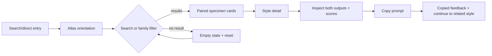
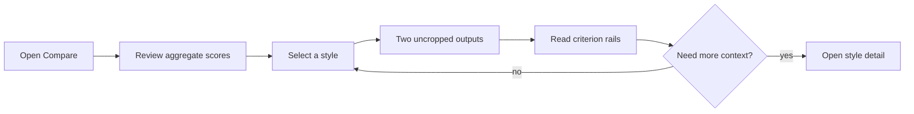

# 03 · UX architecture, sitemap và wireframes

## UX decision record

Experience context là hybrid: SEO/reference cần route ổn định; discovery/compare cần state client-side.

Evidence → need → alternatives → decision:

- Gallery prompt phổ biến dùng search/facets → người dùng chưa biết style chính xác → masonry/infinite vs stable grid → **stable grid + search + family chips**, dễ quay lại và so vị trí.
- Prompt cần gắn với output → modal vs detail route → **detail route** cho share, SEO, history và related styles.
- Ảnh khác tỷ lệ → overlay slider vs side-by-side → **side-by-side contain** để không cắt/xuyên ảnh.
- Mobile thiếu chiều ngang → hai cột nhỏ vs segmented provider view → **stack + provider tabs**, vẫn có nút xem cặp theo chiều dọc.

Trade-off: render 90 card DOM nodes nhiều hơn pagination, nhưng dataset nhỏ, search tức thời và ảnh lazy-load nên chấp nhận được.

## Sitemap

```text
/
├── /compare/
├── /methodology/
├── /styles/{slug}/  × 90
└── /404.html
```

### `/` · Atlas

- Job: hiểu giá trị, tìm style, mở detail.
- Regions: masthead → evidence hero → sticky search/filter → gallery → methodology strip → footer.
- Primary: search/filter/open style.
- Secondary: xem favorites, compare, methodology.
- States: default, filtered, favorites-only, empty, copy success qua detail.
- Mobile: hero stack; filter chips scroll ngang; card một cột; sticky search dưới masthead.

### `/compare/` · Model compare

- Job: xem benchmark tổng quan và đổi style để so trực tiếp.
- Regions: summary score band → style selector → paired full images → criterion rails → observation → methodology caveat.
- Primary: chọn style.
- Secondary: mở detail, copy prompt.
- State: default style 001; query `?style=slug` deep-link; invalid query fallback về 001 và báo nhẹ.
- Mobile: provider tab/stack, score table dọc.

### `/styles/{slug}/` · Style detail

- Job: hiểu style, xem hai output, lấy prompt.
- Regions: breadcrumb → title/family → image pair → verdict/score → prompt block → related styles.
- Primary: copy prompt.
- Secondary: favorite, đổi provider view, mở compare.
- Empty/error: slug không tồn tại đi 404 với search link.

### `/methodology/`

- Job: hiểu dataset, công cụ, rubric và giới hạn.
- Regions: setup → rubric → aggregate table → fairness/limitations → downloadable source links.

## Primary flows





## Desktop wireframe · Atlas

```text
┌──────────────────────────────────────────────────────────────────┐
│ PROMPT ATLAS / LDKTECH          Atlas  Compare  Methodology      │ 1
├──────────────────────────────────────────────────────────────────┤
│ 90 STYLES              [large paired hero image / seam]          │ 2
│ 180 OUTPUTS            [ChatGPT             Gemini]              │
│ one clear comparison   [score ticker / open comparison]          │
├──────────────────────────────────────────────────────────────────┤
│ [Search style, prompt…] [All][Painting][Craft]... [Favorites]     │ 3 sticky
├──────────────────────────────────────────────────────────────────┤
│ [paired card] [paired card] [paired card]                         │ 4
│ [name / family / score / view] × 90                               │
├──────────────────────────────────────────────────────────────────┤
│ Methodology / one sample / aspect caveat / report                 │ 5
└──────────────────────────────────────────────────────────────────┘
```

1. Skip link + semantic nav; current route via `aria-current`.
2. Evidence first, không dùng generic CTA hero.
3. Input có label; chips là buttons với `aria-pressed`; count dùng live region.
4. Card link bao phủ title/visual; favorite là button riêng, không nested interactive.
5. Trust/caveat trước footer.

## Mobile wireframe · Atlas

```text
┌──────────────────────────────┐
│ PROMPT ATLAS          [MENU] │
├──────────────────────────────┤
│ 90 styles / 180 outputs      │
│ [paired hero stacked]        │
│ [Explore] [Compare]          │
├──────────────────────────────┤
│ [Search..................]   │ sticky
│ < All  Painting  Craft ... > │ horizontal scroll
├──────────────────────────────┤
│ [CHATGPT | GEMINI pair]      │
│ Style name          score    │
│ family               [save]  │
│ ...                          │
└──────────────────────────────┘
```

Menu là disclosure button, không phụ thuộc hover. Filter không ẩn sau modal để giữ job chính.

## Desktop wireframe · Style detail

```text
┌──────────────────────────────────────────────────────────────────┐
│ ← Atlas / family                                                 │
│ 036  GRAFFITI                                    [♡ Save]        │
├───────────────────────────────┬──────────────────────────────────┤
│ CHATGPT                       │ GEMINI                           │
│ [uncropped image]             │ [uncropped image]                │
│ avg / dimensions              │ avg / dimensions                 │
├───────────────────────────────┴──────────────────────────────────┤
│ VERDICT + five paired score rails                                │
├──────────────────────────────────────────────────────────────────┤
│ PROMPT                                        [Copy prompt]       │
│ source / complete prompt                                        │
├──────────────────────────────────────────────────────────────────┤
│ Related styles                                                   │
└──────────────────────────────────────────────────────────────────┘
```

Mobile: two images stack; segmented buttons jump/focus provider section; copy button sticky only khi prompt block vào viewport. Score rows giữ label trước số theo focus order.

## Empty/recovery wireframe

```text
0 PHONG CÁCH KHỚP “glass pixel sumi”
Thử bớt từ khóa hoặc xem tất cả 90 phong cách.
[Xóa tìm kiếm] [Xem nhóm Hội họa]
```

Dynamic result count có `aria-live="polite"`; focus không tự nhảy khi filter.

